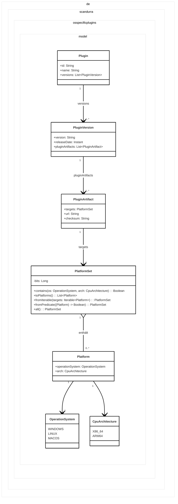

# OS-Specific Plugins

```mermaid
---
config:
  theme: neo
---
classDiagram
    namespace de.scandurra.osspecificplugins.model {
        class Plugin {
          +id: String
          +name: String
          +versions: List~PluginVersion~
        }
        class PluginVersion {
          +version: String
          +releaseDate: Instant
          +pluginArtifacts: List~PluginArtifact~
        }
        class PluginArtifact {
          +targets: PlatformSet
          +url: String
          +checksum: String
        }
        class PlatformSet {
          -bits: Long
          +contains(os: OperationSystem, arch: CpuArchitecture): Boolean
          +toPlatforms(): List~Platform~
          +fromIterable(targets: Iterable~Platform~): PlatformSet
          +fromPredicate((Platform) -> Boolean): PlatformSet
          +all(): PlatformSet
        }
        class Platform {
          +operationSystem: OperationSystem
          +arch: CpuArchitecture
        }
        class OperationSystem {
          WINDOWS
          LINUX
          MACOS
        }
        class CpuArchitecture {
          X86_64
          ARM64
        } 
    }
    Plugin "1" --> "1..*" PluginVersion : versions
    PluginVersion "1" --> "1..*" PluginArtifact : pluginArtifacts
    PluginArtifact "1" --> "1" PlatformSet : targets
    PlatformSet "1" o-- "0..*" Platform : enthält
    Platform "1" --> "1" OperationSystem
    Platform "1" --> "1" CpuArchitecture

```

## License
This project is licensed under the MIT License. See the [LICENSE](LICENSE) file for details.
