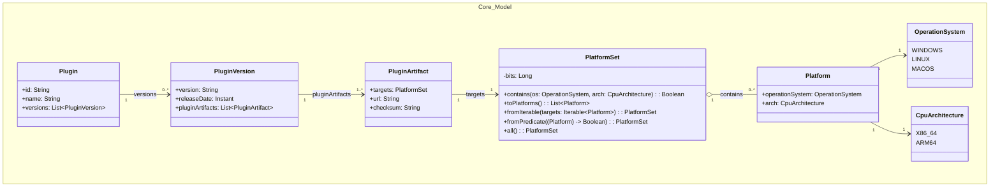

# OS-Specific Plugins
Prototype for the JetBrains internship: a minimal Kotlin/Spring Boot service/CLI that models OS/Arch-specific plugin variants and resolves the best match per client.

## Core Model


## HTTP API
Start the Spring Boot application. To have some sample data available, enable the "dev" profile:

```
./gradlew bootRun --args='--spring.profiles.active=dev'
```

The API will start on http://localhost:8080.

OpenAPI/Swagger UI (provided by springdoc):
- Swagger UI: http://localhost:8080/swagger-ui/index.html
- OpenAPI JSON: http://localhost:8080/v3/api-docs

If you dont want to run it locally, the [integration test](src/test/kotlin/de/scandurra/osspecificplugins/http/PluginControllerIntegrationTest.kt) provides good insights into the API..

## CLI Usage
The same application also provides a small CLI mode. Enable the dev profile (for sample data) and pass the `--cli` option along with non-option arguments: `<pluginId> <OS> <ARCH>`.

```
./gradlew bootRun --args='--spring.profiles.active=dev --cli <id> <os> <arch>'
Example:
./gradlew bootRun --args='--spring.profiles.active=dev --cli wsl WINDOWS X86_64'
```

## Repository and Persistence
At the moment, the application uses an in-memory repository implementation.
Although the service is in-memory only, the current bitflag representation of PlatformSet maps well to a relational database schema. 

## License
This project is licensed under the MIT License. See the [LICENSE](LICENSE) file for details.
